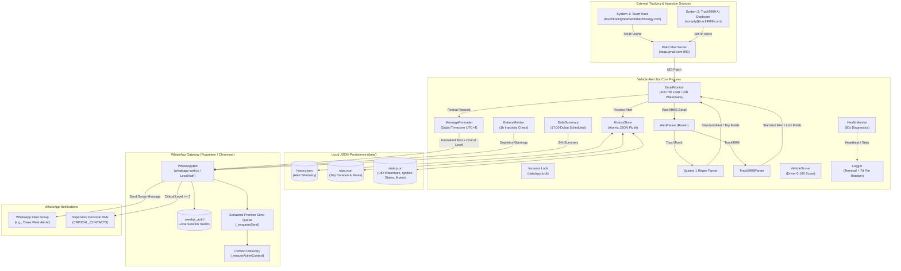
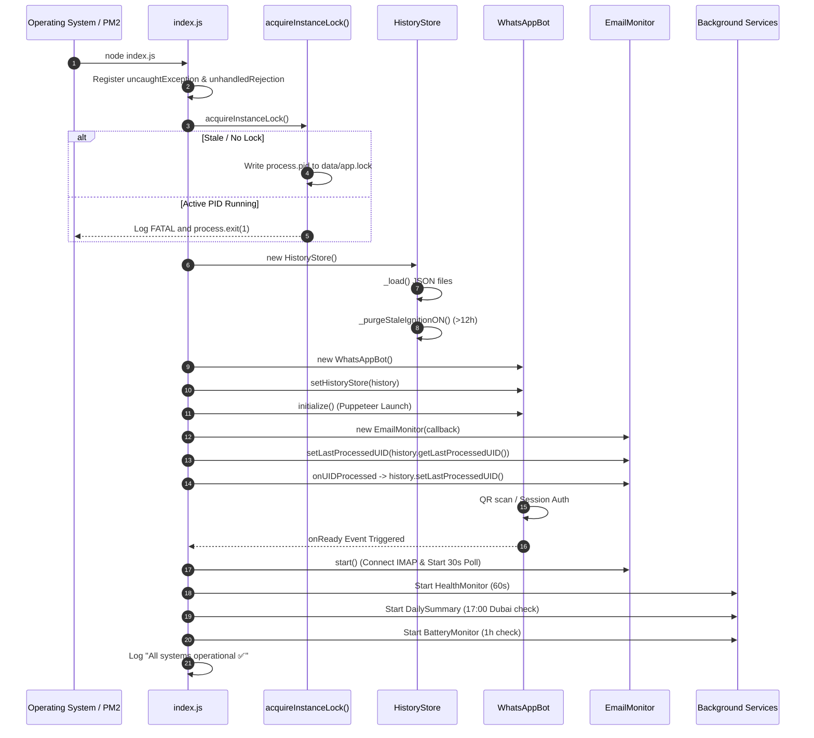
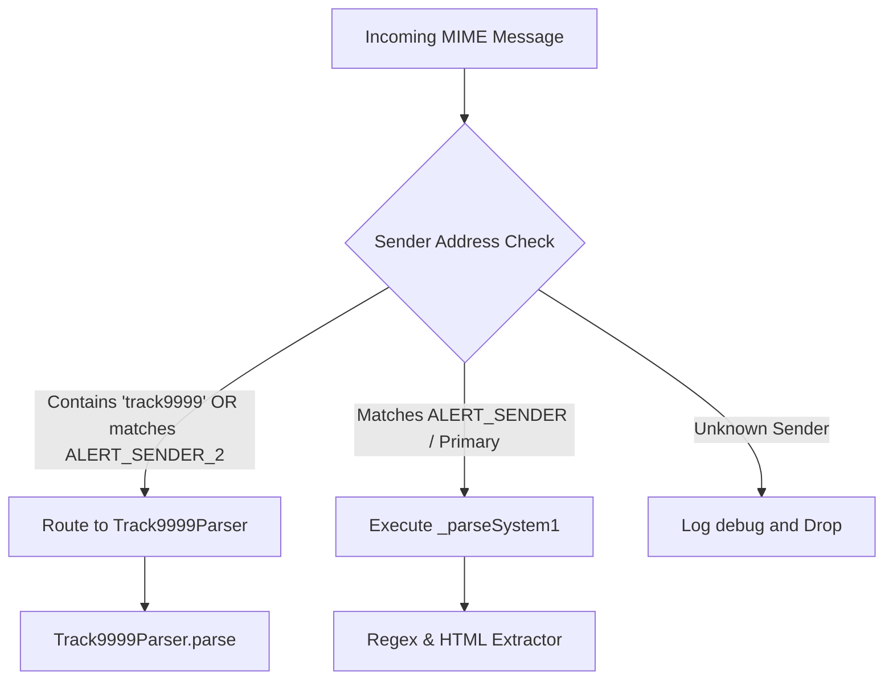
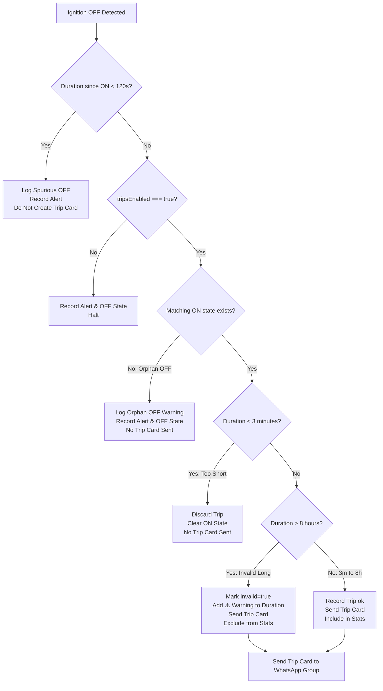
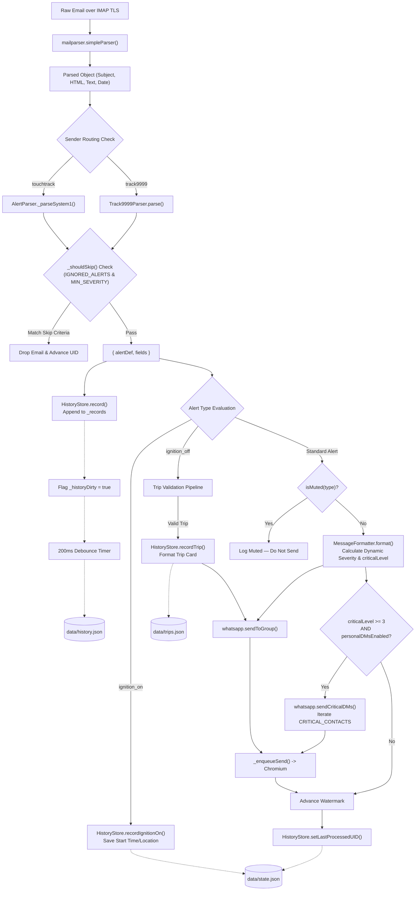
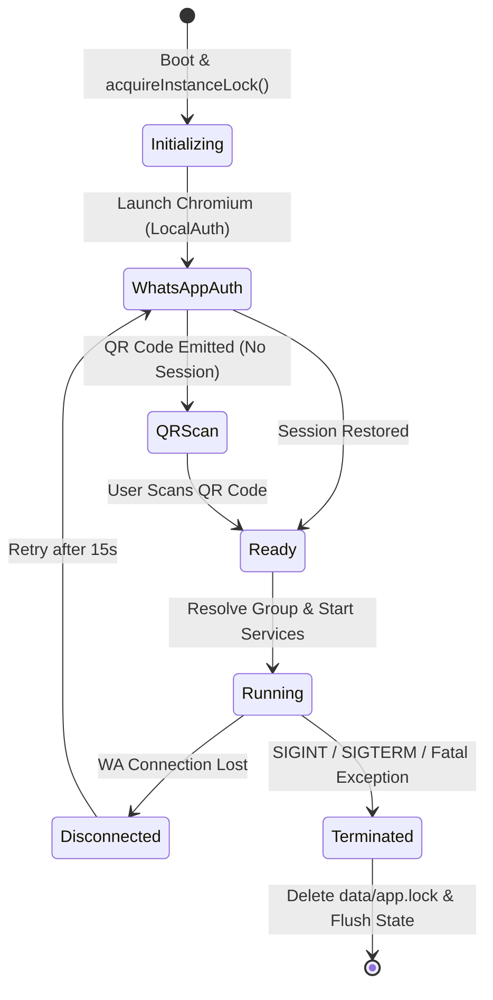
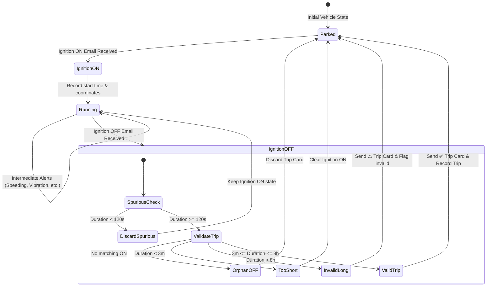

# Vehicle Alert Bot — Complete System Analysis

**Analysis Date:** 02 September 2026  
**Repository:** `vehicle-alert-bot`  
**Analysis Type:** Complete Current-State Architecture & Business Flow Analysis  
**Source of Truth:** Current Repository Implementation  

---

## Table of Contents
1. [A. Executive Summary](#a-executive-summary)
2. [B. High-Level System Architecture](#b-high-level-system-architecture)
3. [C. Complete End-to-End Flow](#c-complete-end-to-end-flow)
4. [D. File-by-File Architecture](#d-file-by-file-architecture)
5. [E. Entry Point & Application Boot Flow](#e-entry-point--application-boot-flow)
6. [F. Email / IMAP Pipeline](#f-email--imap-pipeline)
7. [G. Alert Source & Parser Architecture](#g-alert-source--parser-architecture)
8. [H. Complete Alert Type Catalog](#h-complete-alert-type-catalog)
9. [I. Business Rules](#i-business-rules)
10. [J. Notification Routing Matrix](#j-notification-routing-matrix)
11. [K. Severity & Critical Level System](#k-severity--critical-level-system)
12. [L. WhatsApp Architecture](#l-whatsapp-architecture)
13. [M. Message Formatting](#m-message-formatting)
14. [N. Database / History / State](#n-database--history--state)
15. [O. Ignition & Trip System](#o-ignition--trip-system)
16. [P. Background / Scheduled Services](#p-background--scheduled-services)
17. [Q. Health Monitoring & Observability](#q-health-monitoring--observability)
18. [R. Logging System](#r-logging-system)
19. [S. Error Handling & Recovery](#s-error-handling--recovery)
20. [T. Configuration & Environment](#t-configuration--environment)
21. [U. Data Flow](#u-data-flow)
22. [V. State Machine](#v-state-machine)
23. [W. Real-Time Event Example](#w-real-time-event-example)
24. [X. Duplication & Idempotency](#x-duplication--idempotency)
25. [Y. Security & Operational Considerations](#y-security--operational-considerations)
26. [Z. Current System Limitations & Risks](#z-current-system-limitations--risks)
27. [AA. Actual vs Expected Business Behavior](#aa-actual-vs-expected-business-behavior)
28. [AB. Complete Flow Summary](#ab-complete-flow-summary)

---

## A. Executive Summary

### What This Bot Does
The **Vehicle Alert Bot** is an automated bridge between vehicle GPS tracking systems and WhatsApp. When commercial vehicle trackers detect safety or operational events (such as speeding, phone distraction, harsh braking, tampering, low battery, or ignition changes), they send automated notification emails to a central mailbox. The bot continuously monitors this mailbox over secure IMAP, extracts critical alert fields (vehicle plate, event time, speed, address, coordinates, and platform links), records historical fleet telemetry, calculates driver risk scores and completed trip durations, and delivers formatted notifications into a designated WhatsApp fleet management group as well as direct personal alerts to safety supervisors for critical incidents.

### Why It Exists
GPS tracking platforms typically generate high-volume email alerts that get buried in inboxes, causing fleet managers and site supervisors to miss critical safety violations, collisions, or unauthorized vehicle movement. By delivering these events instantly to WhatsApp—the primary communication channel for field operations—supervisors can act immediately. Additionally, the bot automates trip tracking (pairing Ignition ON and OFF events into trip completion cards) and provides real-time driver behavior scoring and interactive command reporting.

### Main Inputs and Outputs
*   **Main Inputs:**
    *   MIME-formatted email alerts received in a Gmail/IMAP inbox from two primary tracking providers:
        1.  *System 1 (TouchTrack / Primary fleet system)*: `touchtrack@teamworldtechnology.com` (configured via `ALERT_SENDER`).
        2.  *System 2 (Track9999 / AI Dashcam & Tracker)*: `noreply@track9999.com` (configured via `ALERT_SENDER_2`).
    *   Interactive incoming WhatsApp chat commands (`!vehicle`, `!score`, `!leaderboard`, `!idle`, `!trip`, `!help`, and admin commands `!turnoff`, `!turnon`, `!tripreset`).
*   **Main Outputs:**
    *   Real-time formatted WhatsApp messages to the designated fleet group (`WHATSAPP_GROUP_NAME`).
    *   Personal WhatsApp Direct Messages (DMs) to supervisor numbers (`CRITICAL_CONTACTS`) for high-severity alerts.
    *   Automated daily fleet summary reports posted at 17:00 Dubai time.
    *   Hourly battery depletion warnings for inactive vehicles.
    *   JSON-based persistence files in `data/` (`history.json`, `trips.json`, `state.json`).
    *   Rotated daily execution logs in `logs/app-YYYY-MM-DD.log`.

### Systems It Connects
```
[Vehicle Hardware / Trackers]
         │ (Cellular / GPRS)
         ▼
[Tracking Platform Clouds (TouchTrack & Track9999)]
         │ (SMTP)
         ▼
[IMAP Mail Server (Gmail / Outlook / Custom)]
         │ (IMAP TLS / UID Polling)
         ▼
[ Vehicle Alert Bot Application (Node.js) ]
         │ (Puppeteer / Chromium / DevTools Protocol)
         ▼
[ WhatsApp Web Client (whatsapp-web.js) ]
         │ (WhatsApp Network)
         ▼
[ Fleet Management Group & Safety Supervisors' Mobile Devices ]
```

---

## B. High-Level System Architecture



---

## C. Complete End-to-End Flow

The following sequence details the precise execution path implemented across the codebase:

1.  **Process Boot & Instance Lock Acquisition:**
    *   Node loads environment variables via `dotenv.config()`.
    *   `index.js` invokes `acquireInstanceLock()`.
    *   It checks `data/app.lock`. If a lock exists, it reads the PID and executes `process.kill(existingPid, 0)` to verify if the process is alive. If alive, the process aborts with `process.exit(1)`. If stale, it logs a warning and overwrites the lock file with the current PID.
    *   Process-level hooks for `exit`, `SIGINT`, and `SIGTERM` are registered to delete `data/app.lock`.
    *   Global crash catchers `uncaughtException` and `unhandledRejection` log fatal diagnostic entries.
2.  **HistoryStore Initialization:**
    *   `HistoryStore` instantiates and loads `data/history.json`, `data/trips.json`, and `data/state.json`.
    *   It executes `_purgeStaleIgnitionON()` to evict any `lastIgnitionOn` records older than 12 hours (`STALE_ON_MS = 43,200,000 ms`).
3.  **WhatsApp Client Launch:**
    *   `WhatsAppBot` instantiates with `LocalAuth` pointed to `./.wwebjs_auth` and headless Chromium args (`--no-sandbox`, `--disable-setuid-sandbox`, `--disable-dev-shm-usage`, `--disable-gpu`).
    *   `whatsapp.setHistoryStore(history)` binds state access.
    *   `whatsapp.initialize()` triggers Chromium launch.
4.  **WhatsApp Authentication & Ready Event:**
    *   If no session exists, the QR code is printed to the terminal using `qrcode-terminal`.
    *   Upon successful auth and loading, the `ready` event fires.
    *   The bot performs group resolution using an in-page search via Puppeteer (`window.Store.Chat.getModelsArray()`), falling back to `client.getChats()`.
5.  **Service Startup:**
    *   Inside the `whatsapp.onReady` callback, `emailMonitor.setLastProcessedUID(history.getLastProcessedUID())` loads the watermark (e.g., UID `118919`).
    *   `emailMonitor.onUIDProcessed((uid) => history.setLastProcessedUID(uid))` registers the watermark persistence callback.
    *   `emailMonitor.start()` is called.
    *   Background services `HealthMonitor`, `DailySummary`, and `BatteryMonitor` are started.
6.  **IMAP Connection & Mailbox Open:**
    *   `EmailMonitor` connects to the IMAP host via `ImapFlow` with TLS on port 993.
    *   It opens the `INBOX` mailbox.
    *   An initial poll runs immediately, followed by a recurring timer every 30 seconds (`POLL_INTERVAL_MS = 30_000`).
7.  **Poll Execution & Dual-Sender Search:**
    *   A lookback boundary of 30 days is calculated (`LOOKBACK_DAYS = 30`).
    *   `client.search({ from: sender, since })` is queried independently for both `ALERT_SENDER` and `ALERT_SENDER_2`.
    *   Returned UIDs are merged into a deduplicated `Set` and sorted in ascending order.
8.  **Watermark Check & First-Run Logic:**
    *   If `_lastProcessedUID === 0` (initial cold run), the bot sets the watermark to `Math.max(...uidList)` and skips existing email processing to prevent spamming historical alerts.
    *   On subsequent runs, UIDs are filtered: `newUIDs = uidList.filter(uid => uid > this._lastProcessedUID)`.
    *   If `newUIDs.length === 0`, polling finishes.
9.  **Message Fetch & MIME Parsing:**
    *   New messages are fetched using `client.fetch(newUIDs.join(','), { source: true, uid: true })`.
    *   `mailparser.simpleParser(msg.source)` parses raw email streams into subject, text, HTML, and sender metadata.
10. **Sender Verification & Router Dispatch:**
    *   `fromAddr` is checked against known senders. Unknown senders are ignored.
    *   `AlertParser.parse(mail)` evaluates `fromAddr`. If it contains `track9999` or matches `ALERT_SENDER_2`, it routes to `Track9999Parser.parse(mail)`; otherwise, it calls `_parseSystem1(mail)`.
11. **Alert Matching & Keyword Detection:**
    *   The combined subject and body text are checked against keywords in `data/alertTypes.json`.
    *   If no keyword matches, the alert falls back to `type: "unknown"`.
    *   If the alert type is configured in `IGNORED_ALERTS` or its severity is below `MIN_SEVERITY`, the parser returns `null` and processing halts.
12. **Telemetry Field Extraction:**
    *   *System 1:* Extracts plate, vehicle model, speed, speed limit, idle time, idle limit, GPS coords, and HTML Google Maps links.
    *   *Track9999:* Extracts plate from brackets, event name, embedded speed from event name, IMEI, and portal tracking URLs or Google Maps links.
13. **Ignition ON Branch:**
    *   If `alertDef.type === 'ignition_on'`:
        *   Calls `history.recordIgnitionOn(plate, offTime, address, mapsUrl)`.
        *   Calls `history.record(alertDef, fields, mail)` to save to history.
        *   Returns immediately. **Ignition ON is never sent to WhatsApp.**
14. **Ignition OFF & Trip Validation Branch:**
    *   If `alertDef.type === 'ignition_off'`:
        *   Evaluates `history.isSpuriousOff(plate, offTime)`. If duration since ON is `< 120 seconds`, it records the alert and halts.
        *   Retrieves `onData = history.getLastIgnitionOn(plate)`.
        *   Calculates `durationMs = offTime - onData.time`.
        *   If `history.isTripsEnabled()`:
            *   Executes `history.recordTrip(...)`.
            *   If `reason === 'no_start'` (orphan OFF): logs warning, records alert, saves `lastIgnitionOff`, and halts without sending a trip card.
            *   If `reason === 'too_short'` (`< 3 minutes`): records alert, saves `lastIgnitionOff`, clears active ON state, and halts without sending a trip card.
            *   If `reason === 'invalid_long'` (`> 8 hours`): flags trip as `invalid: true`, prefixes duration with `⚠️ duration (unverified — possible missed alert)`, and proceeds.
        *   Clears `lastIgnitionOn` for that plate.
        *   If `history.isMuted('ignition_off')`, halts.
        *   Calls `formatter.formatTripComplete(...)`.
        *   Calls `whatsapp.sendToGroup(text)` to deliver the trip card.
15. **Standard Alert Notification Branch:**
    *   For all other alert types:
        *   `history.record(alertDef, fields, mail)` persists event in `_records`.
        *   If `history.isMuted(alertDef.type)` is active, logs that the category is muted and returns.
        *   `formatter.format(alertDef, fields)` calculates dynamic severity label and `criticalLevel` (0 to 4).
        *   Calls `whatsapp.sendToGroup(text)` via the serialized queue.
        *   If `criticalLevel >= 3` (e.g. speed excess $\ge 10\text{ km/h}$, idle overage $\ge 15\text{ min}$, or static `CRITICAL` alerts), it constructs a supervisor alert message and calls `whatsapp.sendCriticalDMs(dmText)` to dispatch DMs to all numbers in `CRITICAL_CONTACTS`.
16. **Watermark Advancement & Health Metric Update:**
    *   Upon successfully processing the message, `_lastProcessedUID` is updated in memory.
    *   `_onStateChange(uid)` triggers `history.setLastProcessedUID(uid)`, flagging `_stateDirty = true`.
    *   Counters `emailsReceived`, `alertsSent`, and `lastEmailAt` are incremented in `HealthMonitor` stats.

---

## D. File-by-File Architecture

| File Path | Responsibility | Inputs | Outputs | Dependencies |
| :--- | :--- | :--- | :--- | :--- |
| `index.js` | Main entry point; process lifecycle; instance locking; top-level event coordination between email, history, formatter, and WhatsApp. | Environment variables, command-line execution (`node index.js`). | Bootstraps child services; acquires `data/app.lock`. | `dotenv`, `fs`, `path`, all local services, `utils/logger`. |
| `config/settings.js` | Centralized runtime configuration; resolves IMAP provider presets; parses `.env` parameters and comma-separated lists. | `process.env` | Config object (`email`, `whatsapp`, `alerts`, `health`, `adminNumber`, `criticalContacts`). | None (Node built-ins). |
| `services/emailMonitor.js` | IMAP client connection manager; 30s polling loop; dual-sender search; UID watermark deduplication; MIME parsing. | IMAP credentials, sender addresses, `onAlert` callback. | Passes parsed MIME email and alert data to callback; advances UID watermark. | `imapflow`, `mailparser`, `config/settings`, `services/alertParser`, `utils/logger`. |
| `services/alertParser.js` | Alert router; detects email source; executes System 1 regex parser; extracts location from HTML; applies filtering. | Parsed MIME mail object. | `{ alertDef, fields }` or `null` if filtered/skipped. | `data/alertTypes.json`, `config/settings`, `services/track9999Parser`, `utils/logger`. |
| `services/track9999Parser.js` | Specialized parser for Track9999 alerts; parses subject brackets; extracts embedded speeds, IMEIs, and tracking portal links. | Parsed MIME mail object. | `{ alertDef, fields }` with `source: 'track9999'`. | `data/alertTypes.json`, `config/settings`, `utils/logger`. |
| `services/messageFormatter.js` | Formats alerts and trip cards into bold WhatsApp markdown; converts UTC dates to Asia/Dubai; computes dynamic severity. | `alertDef`, `fields`, trip objects. | `{ text, criticalLevel }` strings for WhatsApp transmission. | None (pure formatting logic). |
| `services/whatsappBot.js` | WhatsApp client controller via Puppeteer; handles QR auth, session resumption, safe DOM chat search, message queue, and commands. | Outgoing message text; incoming WhatsApp messages (`!commands`). | Group messages; direct supervisor DMs; interactive command replies. | `whatsapp-web.js`, `qrcode-terminal`, `config/settings`, `services/vehicleScorer`, `services/messageFormatter`, `utils/logger`. |
| `services/historyStore.js` | State and telemetry persistence layer; validates trips; manages active ignition states, mutes, and debounced atomic disk writes. | Incoming alert records, trip events, admin mute/toggle commands. | Persistent JSON files (`history.json`, `trips.json`, `state.json`); aggregated fleet stats. | `fs`, `path`, `utils/logger`. |
| `services/vehicleScorer.js` | Driver safety evaluation engine; calculates individual and fleet-wide driver scores (0–100) using a weighted deduction table. | Historical alert records array. | Ranked vehicle scores, deductions breakdown, and fleet leaderboards. | None (pure math logic). |
| `services/dailySummary.js` | Scheduled service running at 17:00 Dubai time; aggregates 24-hour fleet alerts, completed trips, and idle statistics. | `HistoryStore` telemetry for last 24h. | Formatted daily summary message sent to the WhatsApp group. | `config/settings`, `utils/logger`. |
| `services/batteryMonitor.js` | Inactivity monitor running every 1 hour; detects vehicles with no ignition activity for $\ge 24\text{ hours}$. | Known fleet plates and `lastIgnitionActivity` from `HistoryStore`. | Battery depletion warning alert sent to the WhatsApp group. | `utils/logger`. |
| `services/healthMonitor.js` | Diagnostics and observability reporter; prints live status line to stdout/log every 60s; warns of overdue polls or high reconnects. | Operational stats from `EmailMonitor`, `WhatsAppBot`, and `HistoryStore`. | Formatted health logs; alert warnings on network degradation. | `config/settings`, `utils/logger`. |
| `utils/logger.js` | Production logging utility; formats timestamped colored console output; maintains uncolored daily log files; auto-rotates 7 days. | Log messages, arbitrary metadata, objects, errors. | Console stdout/stderr; file writes to `logs/app-YYYY-MM-DD.log`. | `fs`, `path`. |
| `data/alertTypes.json` | Master catalog of 32 alert type definitions with keyword matchers, severities, icons, and source tags. | Static configuration file. | Used by parsers and UI menus to identify and categorize events. | None (JSON). |
| `data/state.json` | Persistent state snapshot maintaining current UID watermark, ignition tracking, muted categories, and feature flags. | Managed exclusively by `HistoryStore`. | Preserves runtime state across process restarts. | None (JSON). |

---

## E. Entry Point & Application Boot Flow

The entry point of the application is [index.js](file:///c:/Users/Shreyas-Wakhare/Desktop/Mostafa%20Files/Mostafa%20Files/Documents/vehicle-alert-bot/index.js).



### Instance Lock Details
*   File location: `data/app.lock`.
*   Safety check: Before taking the lock, `index.js` checks if the file exists. If it does, it reads the PID and executes `process.kill(existingPid, 0)`.
    *   If `process.kill` succeeds, the operating system confirms an existing bot instance is running. It logs:  
        `Startup blocked: Another instance of Vehicle Alert Bot is already running (PID ...).`  
        and immediately exits with code `1`.
    *   If `process.kill` throws an error (e.g. `ESRCH`), the process does not exist. It logs:  
        `Removing stale instance lock file from PID ...`  
        and continues.
*   The current PID is written to `data/app.lock`. Cleanup listeners are registered on `exit`, `SIGINT`, and `SIGTERM` to synchronously remove the lock file.

---

## F. Email / IMAP Pipeline

The email pipeline is encapsulated entirely in [services/emailMonitor.js](file:///c:/Users/Shreyas-Wakhare/Desktop/Mostafa%20Files/Mostafa%20Files/Documents/vehicle-alert-bot/services/emailMonitor.js).

### Monitored Mailbox & Presets
*   Mailbox monitored: `INBOX`.
*   Presets defined in `config/settings.js`:
    *   `gmail`: `imap.gmail.com:993` (SSL/TLS).
    *   `outlook`: `outlook.office365.com:993` (SSL/TLS).
    *   `yahoo`: `imap.mail.yahoo.com:993` (SSL/TLS).
    *   `custom`: Configured via `IMAP_HOST` and `IMAP_PORT`.

### Polling Mechanism (No IMAP IDLE)
*   The codebase **does not use IMAP IDLE**. It implements a strict 30-second polling interval using `setInterval(() => this._poll(), 30_000)`.
*   A re-entrancy guard `this._polling` prevents concurrent poll executions if an existing fetch or network operation is in progress.

### Dual-Sender Search Strategy
In every poll cycle, the monitor executes an independent search for each configured sender over a 30-day window:
```javascript
const since = new Date();
since.setDate(since.getDate() - LOOKBACK_DAYS); // 30 days
for (const sender of senders) {
  const uids = await this.client.search({ from: sender, since }, { uid: true });
  if (Array.isArray(uids)) uids.forEach(u => allUIDs.add(u));
}
const uidList = [...allUIDs].sort((a, b) => a - b);
```

### Watermark & Deduplication
1.  **Cold Boot / Watermark Initialization:** If `_lastProcessedUID === 0`, the bot identifies the highest UID found (`Math.max(...uidList)`), assigns `_lastProcessedUID = maxUID`, invokes the persistence callback, and skips historical messages.
2.  **Incremental Processing:** When `_lastProcessedUID > 0`, it computes:
    `newUIDs = uidList.filter(uid => uid > this._lastProcessedUID)`
3.  **Fetch & Advance:** It fetches `newUIDs.join(',')`. As each message is parsed and processed, if `msg.uid > this._lastProcessedUID`, it immediately updates the watermark and triggers an atomic state save. Even if a subsequent message in the batch fails, previously processed UIDs are committed.

### Reconnection Strategy
*   Initial delay: $5,000\text{ ms}$ (`RECONNECT_INIT_MS`).
*   Backoff multiplier: $2\times$ (`RECONNECT_MULTIPLIER`).
*   Maximum delay: $300,000\text{ ms}$ (5 minutes, `RECONNECT_MAX_MS`).
*   If an IMAP error or disconnect occurs, `_scheduleReconnect()` clears the polling timer, computes `_reconnectDelay`, schedules a reconnection attempt, logs the attempt count, and resets the delay back to 5s upon a successful connection.

---

## G. Alert Source & Parser Architecture

The alert parsing pipeline begins in [services/alertParser.js](file:///c:/Users/Shreyas-Wakhare/Desktop/Mostafa%20Files/Mostafa%20Files/Documents/vehicle-alert-bot/services/alertParser.js) and branches into [services/track9999Parser.js](file:///c:/Users/Shreyas-Wakhare/Desktop/Mostafa%20Files/Mostafa%20Files/Documents/vehicle-alert-bot/services/track9999Parser.js).

### Parser Selection Logic


### Extraction Patterns Comparison

| Telemetry Field | System 1 (TouchTrack) Implementation | System 2 (Track9999) Implementation |
| :--- | :--- | :--- |
| **Sender Email** | `config.email.alertSender` (`touchtrack@teamworldtechnology.com`) | `config.email.alertSender2` (`noreply@track9999.com`) |
| **Plate Number** | `Your\s+([A-Z0-9\/]+)-` | Subject regex: `\[([A-Z0-9][A-Z0-9\-\/]+)\]\s*$`<br/>Body fallback: `Tracker\s+Name:\s*([A-Z0-9][A-Z0-9\-\/]+)` |
| **Vehicle Model** | `Your\s+[A-Z0-9\/]+-(.+?)\s+(?:is\s+\|ignition)` | *Not determinable from current repository* (`null`) |
| **Speed** | Regex matching kmph in excess string or `\n\s*(\d+)\s*kmph` | Regex matching event string: `\((\d+(?:\.\d+)?)\s*km\/h\)` |
| **Speed Limit** | `speed\s+limit\s+(\d+)\s*kmph` | *Not determinable from current repository* (`null`) |
| **Idle Time / Limit** | `Idle\s+limit\s+\d+\s*minutes[\s\S]*?\n\s*(\d+)` | *Not determinable from current repository* (`null`) |
| **Alert Event Time** | `\bon\s+(\d{4}-\d{2}-\d{2}\s+\d{2}:\d{2}:\d{2})` or ISO format | `Time:\s*(\d{4}-\d{2}-\d{2}\s+\d{2}:\d{2}:\d{2})` or `mail.date` |
| **IMEI** | *Not determinable from current repository* (`null`) | `IMEI:\s*(\d+)` |
| **Address** | HTML anchor link inner text (stripped of Google Plus Codes) or fallback `__[(...)]__` | *Not determinable from current repository* (`null`) |
| **Maps / Portal URL** | Google Maps anchor `href` matching `maps.google` or `goo.gl/maps` | Google Maps `href` if present; otherwise captures portal tracking link `Position: <a href="...">` as `trackUrl` |

### Location Extraction & Plus Code Stripping
In System 1, GPS locations frequently contain Google Plus Codes (e.g. `7H58+8Q Dubai - United Arab Emirates`). The helper function `_stripPlusCode()` uses the regex:
```javascript
raw.replace(/^[A-Z0-9]{4,8}\+[A-Z0-9]{2,3}\s*-\s*/i, '').trim();
```
This isolates clean human-readable street or area names.

---

## H. Complete Alert Type Catalog

The complete catalog defined in [data/alertTypes.json](file:///c:/Users/Shreyas-Wakhare/Desktop/Mostafa%20Files/Mostafa%20Files/Documents/vehicle-alert-bot/data/alertTypes.json) contains **exactly 32 alert type definitions** (31 specific definitions and 1 generic fallback).

| # | Alert Type | Internal Type | Source | Static Severity | Detection Keywords | WhatsApp Group | Personal DM | Special Rule |
| :- | :--- | :--- | :--- | :--- | :--- | :--- | :--- | :--- |
| 1 | Over Speed | `speeding` | system1 | HIGH | `over speed`, `overspeed`, `speed alert`, `exceeding the speed limit`, `speed violation` | Yes | If excess $\ge 10\text{ km/h}$ | Dynamic severity (1–4 🔴). Critical DM triggered at level $\ge 3$. |
| 2 | Ignition ON | `ignition_on` | system1 | LOW | `ignition on alert`, `ignition was turned on`, `ignition on` | **No** | **No** | **Never sent to group/DM.** Telemetry recorded; saves start location/time in `lastIgnitionOn`. |
| 3 | Ignition OFF | `ignition_off` | system1 | LOW | `ignition off alert`, `ignition was turned off`, `ignition off` | Conditional | **No** | Spurious check ($<120\text{s}$). Validates trip duration ($3\text{m}–8\text{h}$). Dispatches Trip Card. |
| 4 | Excessive Idle | `idle` | system1 | LOW | `excessive idle`, `idle alert`, `exceeding the idle`, `long idle`, `idling` | Yes | If over limit $\ge 15\text{ min}$ | Dynamic severity (🟠 to 3 🔴). Critical DM triggered at level 3. |
| 5 | Harsh Braking | `harsh_braking` | system1 | MEDIUM | `harsh braking`, `hard braking`, `sudden brake`, `harsh brake` | Yes | No | Deducts 4 pts in `VehicleScorer`. |
| 6 | Harsh Acceleration | `harsh_acceleration` | system1 | MEDIUM | `harsh acceleration`, `hard acceleration`, `sudden acceleration` | Yes | No | Deducts 4 pts in `VehicleScorer`. |
| 7 | Geofence Exit | `geofence_exit` | system1 | HIGH | `geofence exit`, `left zone`, `exited zone`, `outside zone`, `geofence violation` | Yes | No | Critical level 0; standard HIGH notification. |
| 8 | Geofence Entry | `geofence_enter` | system1 | LOW | `geofence enter`, `entered zone`, `arrived zone`, `inside zone` | Yes | No | Filtered if `MIN_SEVERITY` $>$ LOW. |
| 9 | SOS Alert | `sos` | both | CRITICAL | `sos alert`, `sos`, `panic`, `emergency`, `distress` | Yes | **Yes** | Static CRITICAL triggers `criticalLevel: 3` and supervisor DMs. -20 pts score deduction. |
| 10 | Device Tampering | `tampering` | both | HIGH | `tamper`, `tampering`, `device removed`, `cover move alert`, `device cover is open`, `device plug-out` | Yes | No | Critical level 0; -20 pts score deduction. |
| 11 | Collision / Accident | `accident` | both | CRITICAL | `ubi collision`, `collision alert`, `vehicle collision`, `crash` | Yes | **Yes** | Static CRITICAL triggers `criticalLevel: 3` and supervisor DMs. -20 pts score deduction. |
| 12 | Low Battery / Power | `low_battery` | both | MEDIUM | `low battery`, `battery low`, `battery alert`, `battery low power shutdown`, `undervoltage`, `external power voltage is too low` | Yes | No | External hardware alert; distinct from `BatteryMonitor` service. |
| 13 | Fuel Drop | `fuel_drop` | system1 | HIGH | `fuel drop`, `fuel loss`, `fuel theft`, `fuel decrease` | Yes | No | Monitored for fuel theft detection. |
| 14 | GPS Jamming / Lost | `gps_lost` | both | HIGH | `gps lost`, `signal lost`, `no gps`, `gps disconnected`, `gps jamming detected`, `device enters the gps signal` | Yes | No | Deducts 2 pts in `VehicleScorer`. |
| 15 | GPS Restored | `gps_restored` | both | LOW | `gps jamming ended`, `device leaves the gps signal` | Yes | No | Filtered if `MIN_SEVERITY` $>$ LOW. |
| 16 | LTE Jamming Detected | `lte_jamming` | track9999 | HIGH | `lte jamming detected`, `lte signal interference` | Yes | No | Deducts 2 pts in `VehicleScorer`. |
| 17 | LTE Jamming Ended | `lte_restored` | track9999 | LOW | `lte jamming ended`, `device leaves the lte signal` | Yes | No | Filtered if `MIN_SEVERITY` $>$ LOW. |
| 18 | Distraction / Phone Use | `distraction` | track9999 | HIGH | `distraction alert`, `playing on the phone`, `driver playing with mobile` | Yes | No | Formatter outputs embedded speed at event time. -10 pts score deduction. |
| 19 | Vibration Alert | `vibration` | track9999 | MEDIUM | `vibration alert`, `the device vibrates` | Yes | No | High-frequency alert from sensitive parked sensors. |
| 20 | UBI Rapid Acceleration | `ubi_acceleration` | track9999 | MEDIUM | `ubi rapid acceleration`, `harsh acceleration` | Yes | No | Usage-Based Insurance telematics metric. |
| 21 | UBI Rapid Deceleration | `ubi_deceleration` | track9999 | MEDIUM | `ubi rapid deceleration`, `ubi collision` | Yes | No | Usage-Based Insurance telematics metric. |
| 22 | Device Offline | `offline` | track9999 | MEDIUM | `offline alert`, `device offline` | Yes | No | Hardware heartbeat disruption. |
| 23 | Camera Blocked | `camera_blocked` | track9999 | HIGH | `camera screen blocked` | Yes | No | AI dashcam lens obstruction. -10 pts score deduction. |
| 24 | No Seat Belt | `seatbelt` | track9999 | HIGH | `not wearing seat belt`, `seatbelt` | Yes | No | AI dashcam safety violation. -10 pts score deduction. |
| 25 | Smoking Detected | `smoking` | track9999 | MEDIUM | `smoking alert`, `driver smokes` | Yes | No | AI dashcam cabin policy violation. -10 pts score deduction. |
| 26 | Fatigue Driving | `fatigue` | track9999 | HIGH | `fatigue driving`, `fatigue alert` | Yes | No | AI dashcam eyelid/yawn detection. -12 pts score deduction. |
| 27 | Engine Failure / Overheat | `engine_failure` | track9999 | CRITICAL | `engine failure`, `vehicle engine failure`, `overheating`, `water temperature is too high` | Yes | **Yes** | Static CRITICAL triggers `criticalLevel: 3` and supervisor DMs. -15 pts score deduction. |
| 28 | Drinking While Driving | `drinking` | track9999 | HIGH | `drinking`, `driver drinks` | Yes | No | AI dashcam driver impairment violation. -12 pts score deduction. |
| 29 | Abrupt Lane Change | `lane_change` | track9999 | MEDIUM | `abrupt lane switching`, `sharp lane change`, `lane switching alarm` | Yes | No | Deducts 3 pts in `VehicleScorer`. |
| 30 | Driver Change Detected | `driver_change` | track9999 | MEDIUM | `driver change detected`, `driver changes` | Yes | No | Facial recognition driver swap. |
| 31 | Voice / Noise Alarm | `voice_alarm` | track9999 | MEDIUM | `voice alarm`, `sound around the device is too loud` | Yes | No | High decibel cabin audio detection. |
| 32 | Unknown Alert Fallback | `unknown` | both | MEDIUM | *None (Fallback when no keyword matches)* | Yes | No | Emoji 📋, Label "Alert". Ensures unmapped alerts are not lost. |

---

## I. Business Rules

### 1. Alert Storage vs Filtering Rules
*   **Storage Invariant:** Every alert that passes the parser's `_shouldSkip()` filter and contains a valid vehicle plate is stored in `HistoryStore._records` via `history.record(alertDef, fields, mail)`.
*   **Static Filtering (`_shouldSkip`):**
    *   If `config.alerts.ignored` includes `alertDef.type` or `alertDef.label.toLowerCase()`, the parser returns `null` and the email is discarded before reaching storage or notification.
    *   If `SEVERITY_ORDER[alertDef.severity] < SEVERITY_ORDER[config.alerts.minSeverity]`, the alert is discarded.
*   **Mute Filtering (`history.isMuted`):**
    *   If an alert type is in `state.mutedCategories`, **it is still stored in history**, but is blocked from forwarding to the WhatsApp group or triggering DMs.

### 2. Ignition ON Business Logic
*   **No WhatsApp Notification:** Ignition ON emails are **never forwarded** to WhatsApp group or DMs.
*   **State Recording:** Captures `plate`, `time`, `address`, and `mapsUrl` / `trackUrl` into `state.json` under `lastIgnitionOn[plate]`.
*   **Overwriting Existing ON:** If a previous ON state existed without an OFF, the bot logs an overwrite and replaces it with the new timestamp.

### 3. Ignition OFF & Trip Validation Rules
When an Ignition OFF email arrives, it undergoes a 5-stage validation pipeline:


### 4. Over Speed Dynamic Escalation Rules
Speeding events are dynamically classified by calculating speed excess:
$$\text{Excess} = \text{Speed} - \text{SpeedLimit}$$

*   $\text{Excess} < 5\text{ km/h} \implies \text{Label: } \text{'🔴'}, \text{ criticalLevel: } 1$
*   $5 \le \text{Excess} < 10\text{ km/h} \implies \text{Label: } \text{'🔴🔴'}, \text{ criticalLevel: } 2$
*   $10 \le \text{Excess} < 15\text{ km/h} \implies \text{Label: } \text{'🔴🔴🔴'}, \text{ criticalLevel: } 3$ (Escalates to Personal DMs)
*   $\text{Excess} \ge 15\text{ km/h} \implies \text{Label: } \text{'🔴🔴🔴🔴'}, \text{ criticalLevel: } 4$ (Escalates to Personal DMs)

### 5. Excessive Idle Dynamic Escalation Rules
Idle events are dynamically classified by calculating idle overage:
$$\text{Overage} = \text{IdleTime} - \text{IdleLimit}$$

*   $\text{Overage} \le 0\text{ min} \implies \text{Label: } \text{'🟠'}, \text{ criticalLevel: } 0$
*   $0 < \text{Overage} < 5\text{ min} \implies \text{Label: } \text{'🟠🔴'}, \text{ criticalLevel: } 1$
*   $5 \le \text{Overage} < 10\text{ min} \implies \text{Label: } \text{'🔴'}, \text{ criticalLevel: } 1$
*   $10 \le \text{Overage} < 15\text{ min} \implies \text{Label: } \text{'🔴🔴'}, \text{ criticalLevel: } 2$
*   $\text{Overage} \ge 15\text{ min} \implies \text{Label: } \text{'🔴🔴🔴'}, \text{ criticalLevel: } 3$ (Escalates to Personal DMs)

### 6. Personal DM Escalation Invariants
Personal DMs are governed by three conditions in [index.js](file:///c:/Users/Shreyas-Wakhare/Desktop/Mostafa%20Files/Mostafa%20Files/Documents/vehicle-alert-bot/index.js) and [services/whatsappBot.js](file:///c:/Users/Shreyas-Wakhare/Desktop/Mostafa%20Files/Mostafa%20Files/Documents/vehicle-alert-bot/services/whatsappBot.js):
1.  `criticalLevel >= 3`: Only events evaluated at criticalLevel 3 or 4 trigger DMs.
2.  `history.isPersonalDMsEnabled() === true`: Admin can toggle this off via `!turnoff personal`.
3.  Recipients: Sent exclusively to numbers defined in `config.criticalContacts`.

---

## J. Notification Routing Matrix

| Alert Category / Event | Group WhatsApp | Personal Supervisor DM | Exact Runtime Condition | Architectural Reason |
| :--- | :--- | :--- | :--- | :--- |
| **Ignition ON** | **Never** | **Never** | `alertDef.type === 'ignition_on'` | High-frequency operational telemetry; stored in memory/state to calculate trip duration on OFF. |
| **Ignition OFF (Spurious)** | **Never** | **Never** | Duration since ON $< 120\text{s}$ | Discarded as accidental key turn or driver stalling. |
| **Ignition OFF (Orphan)** | **Never** | **Never** | `startTime` is null | Bot cannot compute duration without an ON timestamp; prevents sending broken cards. |
| **Ignition OFF (Too Short)** | **Never** | **Never** | Duration $< 3\text{ minutes}$ | Excluded from trip records; vehicle did not undertake an operational trip. |
| **Ignition OFF (Valid Trip)** | **Always** | **Never** | Duration between $3\text{m}$ and $8\text{h}$; not muted | Full trip completion card sent with start/end time, duration, and map links. |
| **Ignition OFF (Invalid Long)** | **Always** | **Never** | Duration $> 8\text{ hours}$; not muted | Trip card sent with `⚠️ (unverified)` warning; stored with `invalid: true` (excluded from stats). |
| **Over Speed (<10 km/h over)** | **Always** | **Never** | $\text{Excess} < 10\text{ km/h}$; not muted | Minor/moderate speeding; criticalLevel is 1 or 2. Group alert only. |
| **Over Speed ($\ge$10 km/h over)** | **Always** | **Always** | $\text{Excess} \ge 10\text{ km/h}$; not muted; DMs enabled | Severe speeding; criticalLevel is 3 or 4. High-risk safety violation. |
| **Excessive Idle (<15m over)** | **Always** | **Never** | $\text{Overage} < 15\text{ min}$; not muted | Standard operational idle notification; criticalLevel is 0, 1, or 2. |
| **Excessive Idle ($\ge$15m over)** | **Always** | **Always** | $\text{Overage} \ge 15\text{ min}$; not muted; DMs enabled | Severe excessive idling; criticalLevel is 3. High fuel waste/engine wear. |
| **SOS Alert** | **Always** | **Always** | Static severity `CRITICAL`; not muted; DMs enabled | Life-safety emergency; criticalLevel is 3. |
| **Collision / Accident** | **Always** | **Always** | Static severity `CRITICAL`; not muted; DMs enabled | Crash event; criticalLevel is 3. |
| **Engine Failure / Overheat** | **Always** | **Always** | Static severity `CRITICAL`; not muted; DMs enabled | Catastrophic mechanical failure risk; criticalLevel is 3. |
| **Tampering / Fatigue / Seatbelt / Smoking / Drinking** | **Always** | **Never** | Static severity `HIGH` or `MEDIUM`; not muted | Evaluates to `criticalLevel: 0`. Delivered to fleet group; excluded from DMs. |
| **Muted Alert Categories** | **Never** | **Never** | `history.isMuted(alertDef.type) === true` | Muted by admin via `!turnoff <n>`. Telemetry stored in DB only. |
| **Battery Depletion Warning** | **Always** | **Never** | Inactive for $\ge 24\text{ hours}$; fires once per day per vehicle | Dispatched by background `BatteryMonitor` directly to WhatsApp group. |
| **Daily Fleet Summary** | **Always** | **Never** | 17:00 Dubai time; fires once per day | Dispatched by background `DailySummary` directly to WhatsApp group. |

---

## K. Severity & Critical Level System

The bot separates **Static Severity** from **Dynamic Severity**:

### Static Severity
Defined per alert in `data/alertTypes.json`: `LOW`, `MEDIUM`, `HIGH`, `CRITICAL`.
Used by `AlertParser._shouldSkip()` to evaluate minimum severity thresholds (`MIN_SEVERITY`):
```javascript
const SEVERITY_ORDER = { LOW: 0, MEDIUM: 1, HIGH: 2, CRITICAL: 3 };
```

### Dynamic Severity (`MessageFormatter._dynamicSeverity`)
Evaluates raw telematics fields to calculate runtime severity labels and `criticalLevel`:

```javascript
// Over Speed
if (alertDef.type === 'speeding' && fields.speed && fields.speedLimit) {
  const excess = parseInt(fields.speed) - parseInt(fields.speedLimit);
  if (excess < 5)  return { severityLabel: '🔴',       criticalLevel: 1 };
  if (excess < 10) return { severityLabel: '🔴🔴',     criticalLevel: 2 };
  if (excess < 15) return { severityLabel: '🔴🔴🔴',   criticalLevel: 3 };
  return             { severityLabel: '🔴🔴🔴🔴', criticalLevel: 4 };
}

// Excessive Idle
if (alertDef.type === 'idle' && fields.idleTime && fields.idleLimit) {
  const over = parseInt(fields.idleTime) - parseInt(fields.idleLimit);
  if (over <= 0)  return { severityLabel: '🟠',       criticalLevel: 0 };
  if (over < 5)   return { severityLabel: '🟠🔴',     criticalLevel: 1 };
  if (over < 10)  return { severityLabel: '🔴',       criticalLevel: 1 };
  if (over < 15)  return { severityLabel: '🔴🔴',     criticalLevel: 2 };
  return            { severityLabel: '🔴🔴🔴',   criticalLevel: 3 };
}

// Default Fallback
return {
  severityLabel: SEVERITY_LABELS[alertDef.severity] || alertDef.severity,
  criticalLevel: alertDef.severity === 'CRITICAL' ? 3 : 0,
};
```

---

## L. WhatsApp Architecture

The WhatsApp subsystem in [services/whatsappBot.js](file:///c:/Users/Shreyas-Wakhare/Desktop/Mostafa%20Files/Mostafa%20Files/Documents/vehicle-alert-bot/services/whatsappBot.js) wraps `whatsapp-web.js` (v1.23.0) controlling a headless Chromium browser.

### Session Persistence
*   Auth Strategy: `LocalAuth({ dataPath: './.wwebjs_auth' })`.
*   Stores IndexedDB tokens, local storage, and service worker caches so restarts do not require re-scanning the QR code.

### Safe DOM Group Resolution Strategy
`whatsapp-web.js`'s standard `client.getChats()` frequently crashes when serializing corrupted group metadata or large chat histories. To circumvent this, the bot implements a direct in-page DOM query:
```javascript
const groupInfo = await this.client.pupPage.evaluate((targetName) => {
  const chats = window.Store?.Chat?.getModelsArray() || [];
  const found = chats.find(c => 
    (c.name === targetName || c.formattedTitle === targetName) && 
    (c.isGroup || c.id?._serialized?.endsWith('@g.us'))
  );
  return found ? { id: found.id._serialized, name: found.name || found.formattedTitle } : null;
}, config.whatsapp.groupName);
```
If this fails, it falls back to `client.getChats()`. Once resolved, the group object is cached in `this.targetGroup`.

### Send Queue & Context Recovery
To prevent browser race conditions, detached frame exceptions, and rate-limit drops:
1.  **Serialized Promise Chain:** All sends run through `_enqueueSend(fn)`:
    `this._sendQueue = this._sendQueue.then(async () => { await this._ensureActiveContext(); await fn(); });`
2.  **Context Recovery:** `_ensureActiveContext()` executes `client.pupPage.evaluate(() => true)`. If Chromium undergoes an internal frame navigation or context recreation, it catches the error, clears `this.targetGroup`, pauses for $1,000\text{ ms}$, and verifies context stabilization before allowing the send to proceed.

### Interactive WhatsApp Commands

```
┌───────────────────────────┬───────────────────────────┬──────────────────────────────────────────────┐
│ Command                   │ Access Level              │ Description & Output                         │
├───────────────────────────┼───────────────────────────┼──────────────────────────────────────────────┤
│ !vehicle <plate>          │ Everyone                  │ Plate telemetry, driver score, trip/idle     │
│                           │                           │ totals, and breakdown by alert type.         │
│ !score <plate>            │ Everyone                  │ 0–100 safety score, grade, deduction sum,    │
│                           │                           │ and violation breakdown.                     │
│ !leaderboard [1|3|7|14]   │ Everyone                  │ Ranked driver safety table for period        │
│                           │                           │ (default: 7 days) with top 2 violations.     │
│ !idle <period>            │ Everyone                  │ Fleet idle summary for 1h, 2h, 3h, 6h, 12h,  │
│                           │                           │ or 24h.                                      │
│ !trip <period>            │ Everyone                  │ Fleet valid trip count & total duration for  │
│                           │                           │ 1h, 2h, 3h, 6h, 12h, or 24h.                 │
│ !help                     │ Everyone                  │ Prints user manual & command guide.          │
│ !turnoff personal         │ Admin Personal DM Only    │ Disables supervisor Critical Personal DMs.   │
│ !turnon personal          │ Admin Personal DM Only    │ Re-enables supervisor Critical Personal DMs. │
│ !turnoff help             │ Admin Personal DM Only    │ Interactive menu listing mutable categories. │
│ !turnon help              │ Admin Personal DM Only    │ Interactive menu listing unmutable categories│
│ !turnoff <number>         │ Admin Personal DM Only    │ Mutes alert category <number> (stored only). │
│ !turnon <number>          │ Admin Personal DM Only    │ Unmutes alert category <number>.             │
│ !tripreset                │ Admin (Group or DM)       │ Purges all active ignition ON states.        │
└───────────────────────────┴───────────────────────────┴──────────────────────────────────────────────┘
```

---

## M. Message Formatting

Formatting logic is located in [services/messageFormatter.js](file:///c:/Users/Shreyas-Wakhare/Desktop/Mostafa%20Files/Mostafa%20Files/Documents/vehicle-alert-bot/services/messageFormatter.js). All timestamps are converted to `Asia/Dubai` (UTC+4) in 24-hour notation.

### 1. Standard Telemetry Alert Template
```text
🚨 *OVER SPEED ALERT*

🚗 *Vehicle:*   CC-48315 — Toyota Hilux
👤 *Driver:*    John Doe

📅 *Time:*      01 Sep 2026, 17:13:28
📊 *Severity:*  🔴🔴🔴🔴

⚡ *Speed:*     118 km/h
🚧 *Limit:*     100 km/h
📈 *Excess:*    +18 km/h

📍 *Location:* Al Quoz Industrial Area 3, Dubai
🗺️  *Maps:*     https://maps.google.com/?q=25.1234,55.2345

─────────────────
```

### 2. Track9999 AI Alert Template
```text
📱 *DISTRACTION / PHONE USE ALERT*
_Distraction Alert(70.9km/h)_

🚗 *Vehicle:*   CC-48315
📅 *Time:*      01 Sep 2026, 17:13:28
📊 *Severity:*  🔴 High

⚡ *Speed at event:* 70.9 km/h
📌 *Track:*    http://www.track9999.com/position?id=12345
🔧 *IMEI:*     864201040123456

─────────────────
```

### 3. Trip Completed Card Template
```text
✅ *TRIP COMPLETED*

🚗 *Vehicle:*  P-17584 — Toyota Hilux
👤 *Driver:*   Ahmed Ali

🟢 *Started:*  01 Sep 2026, 14:10:00
📍            Jebel Ali Free Zone, Dubai
🗺️             https://maps.google.com/?q=25.0123,55.1122

🔴 *Ended:*    01 Sep 2026, 15:42:30
📍            Business Bay, Dubai
🗺️             https://maps.google.com/?q=25.1850,55.2750

🕐 *Duration:* 1h 32m

─────────────────
```

### 4. Critical Supervisor DM Template
```text
⚠️ *HIGH SEVERITY ALERT — 🔴🔴🔴🔴*
🚨 Over Speed
🚗 CC-48315 Toyota Hilux

🚨 *OVER SPEED ALERT*

🚗 *Vehicle:*   CC-48315 — Toyota Hilux
👤 *Driver:*    John Doe

📅 *Time:*      01 Sep 2026, 17:13:28
📊 *Severity:*  🔴🔴🔴🔴

⚡ *Speed:*     118 km/h
🚧 *Limit:*     100 km/h
```

---

## N. Database / History / State

Persistence in `vehicle-alert-bot` is built entirely on localized JSON files written using atomic rename operations.

```
data/
├── app.lock          ← Process lock (PID)
├── history.json      ← Array of all historical alert records
├── trips.json        ← Array of all recorded trips (valid & invalid)
└── state.json        ← Key-value store for runtime watermarks & ignition states
```

### File Schema & Contents

#### 1. `data/history.json`
Stores an append-only flat JSON array of telemetry records:
```json
{
  "id": 1788243193420.1873,
  "plate": "E-30849",
  "vehicleModel": null,
  "alertType": "vibration",
  "alertLabel": "Vibration Alert",
  "severity": "MEDIUM",
  "driver": null,
  "speed": null,
  "speedLimit": null,
  "idleTime": null,
  "idleLimit": null,
  "idleDurationMin": 0,
  "address": null,
  "emailSubject": "Tracker Event Notification[Vibration alert][E-30849]",
  "source": "track9999",
  "receivedAt": "2026-09-01T06:12:41.000Z",
  "loggedAt": "2026-09-01T06:13:13.420Z"
}
```

#### 2. `data/trips.json`
Stores completed trip records:
```json
{
  "id": 1784046520290,
  "plate": "E30849",
  "vehicleModel": "Toyota Hilux",
  "driver": null,
  "startTime": "2026-07-13 17:18:34",
  "startAddress": null,
  "startMapsUrl": null,
  "endTime": "2026-07-14 20:28:05",
  "endAddress": null,
  "endMapsUrl": null,
  "durationMs": 97771000,
  "durationStr": "27h 9m",
  "invalid": true
}
```

#### 3. `data/state.json`
Maintains runtime synchronization state:
```json
{
  "lastIgnitionOn": {
    "P17584": {
      "time": "2026-09-01T14:10:00.000Z",
      "address": "JAFZA",
      "mapsUrl": "https://maps.google.com/..."
    }
  },
  "lastIgnitionOff": {
    "P17584": "2026-09-01T15:42:30.000Z"
  },
  "lastProcessedUID": 118919,
  "dailySummarySent": "2026-08-31",
  "mutedCategories": [],
  "personalDMsEnabled": true,
  "tripsEnabled": true
}
```

### Atomic Disk Write Architecture
To prevent corrupted JSON files during sudden crashes or power loss:
1.  **Dirty Flags:** `_historyDirty`, `_tripsDirty`, `_stateDirty`.
2.  **Debounce Timer:** When data changes, `_scheduleSave()` sets a 200ms timer. Multiple rapid writes within 200ms are coalesced into a single disk sync.
3.  **Atomic Write Pattern:** `_atomicWrite(filePath, data)` writes data to `${filePath}.tmp`. Once the buffer is flushed to disk, it executes synchronous atomic replacement:
    `fs.renameSync(tmp, filePath);`

---

## O. Ignition & Trip System

The trip lifecycle is governed by parameters defined in [services/historyStore.js](file:///c:/Users/Shreyas-Wakhare/Desktop/Mostafa%20Files/Mostafa%20Files/Documents/vehicle-alert-bot/services/historyStore.js):

$$\begin{aligned}
\text{SPURIOUS\_OFF\_WINDOW\_SEC} &= 120\text{ seconds (2 min)} \\
\text{MIN\_TRIP\_MS} &= 180,000\text{ ms (3 min)} \\
\text{MAX\_TRIP\_MS} &= 28,800,000\text{ ms (8 hours)} \\
\text{STALE\_ON\_MS} &= 43,200,000\text{ ms (12 hours)}
\end{aligned}$$

### Scenario Handlers

```
┌───────────────────────────┬───────────────────────────┬──────────────────────────────────────────────┐
│ Scenario                  │ Internal Check / Reason   │ Concrete Action Taken                        │
├───────────────────────────┼───────────────────────────┼──────────────────────────────────────────────┤
│ Spurious Ignition OFF     │ diffSec < 120s            │ Stored in history; ignored for trip creation;│
│                           │                           │ lastIgnitionOn preserved.                    │
│ Orphan Ignition OFF       │ startTime === null        │ Stored in history; logs orphan warning;      │
│                           │ (reason: 'no_start')      │ saves lastIgnitionOff; NO trip card sent.    │
│ Too-Short Trip            │ durationMs < 3 min        │ Discarded; NOT saved to trips.json;          │
│                           │ (reason: 'too_short')     │ clears lastIgnitionOn; NO trip card sent.    │
│ Valid Trip                │ 3 min <= duration <= 8 h  │ Saved to trips.json; duration formatted;     │
│                           │ (reason: 'ok')            │ clears lastIgnitionOn; Trip Card sent.       │
│ Invalid Long Trip         │ durationMs > 8 hours      │ Saved to trips.json with invalid=true;       │
│                           │ (reason: 'invalid_long')  │ duration prefixed with ⚠️ warning;          │
│                           │                           │ Trip Card sent; EXCLUDED from all stats.     │
│ Stale Ignition ON Purge   │ age > 12 hours            │ Executed on bot boot; purges orphaned ON     │
│                           │                           │ records to prevent days-long phantom trips.  │
│ Trips Globally Disabled   │ tripsEnabled === false    │ recordTrip bypassed; no cards sent.          │
└───────────────────────────┴───────────────────────────┴──────────────────────────────────────────────┘
```

---

## P. Background / Scheduled Services

| Service Name | Check Frequency | Execution Condition / Window | Data Consumed | Generated Output |
| :--- | :--- | :--- | :--- | :--- |
| **Email Poller** | Every $30\text{ seconds}$ | Continuous (`setInterval`) | IMAP Inbox, `ALERT_SENDER`, `ALERT_SENDER_2` | Emits parsed alerts and triggers notification pipeline. |
| **Health Monitor** | Every $60\text{ seconds}$ | Continuous (`setInterval`); initial check at $5\text{s}$ | `EmailMonitor.stats`, `HistoryStore` counts, WhatsApp state | Formatted diagnostic status line in terminal and log file. |
| **Daily Summary** | Every $60\text{ seconds}$ | Hour $\ge 17$ Dubai time and `dailySummarySent !== today` | `HistoryStore.getRecentRecords(24)` and `getRecentTrips(24)` | Formatted 24-hour fleet metrics message sent to WhatsApp group. |
| **Battery Monitor** | Every $1\text{ hour}$ | Inactive $\ge 24\text{ hours}$; initial check at $5\text{m}$ | `HistoryStore.lastIgnitionActivity(plate)` | Battery depletion warning alert sent to WhatsApp group (once/day/vehicle). |
| **State Disk Flush** | $200\text{ ms}$ Debounce | Triggered on dirty flag (`_scheduleSave`) | In-memory `_records`, `_trips`, `_state` | Synchronous atomic file writes to `data/*.json`. |
| **Active Context Check**| Per message send | Pre-send hook in `_enqueueSend` | Puppeteer `client.pupPage` execution context | Re-stabilizes detached Chromium frames before dispatching messages. |

---

## Q. Health Monitoring & Observability

The health monitoring system in [services/healthMonitor.js](file:///c:/Users/Shreyas-Wakhare/Desktop/Mostafa%20Files/Mostafa%20Files/Documents/vehicle-alert-bot/services/healthMonitor.js) produces a standardized status line every 60 seconds:

```text
[2026-09-02 08:10:00] INFO   📊 HEALTH | uptime: 24h 12m | IMAP: 🟢 Connected | WA: 🟢 Ready | emails: 245 | sent: 210 | skipped: 35 | reconnects: 0 | last email: 3m ago | last poll: 12s ago | last poll found: 0 new | UID watermark: 118919 | DB: 93420 alerts / 54 vehicles
```

### Metrics Explained

*   `uptime`: Total continuous runtime of the current Node process (`_dur(ms)`).
*   `IMAP`: Evaluates `this.email.isConnected()` (`client?.usable`).
*   `WA`: Evaluates `this.whatsapp.isReady()`.
*   `emails`: Count of all emails received from known senders since boot.
*   `sent`: Count of alerts successfully forwarded to WhatsApp.
*   `skipped`: Count of alerts ignored due to `IGNORED_ALERTS` or `MIN_SEVERITY`.
*   `reconnects`: Number of IMAP reconnection attempts triggered.
*   `last email`: Relative human-readable time since the last email arrived.
*   `last poll`: Relative time since the last IMAP search completed.
*   `last poll found`: Number of new UIDs discovered during the most recent poll.
*   `UID watermark`: Current persisted IMAP UID watermark.
*   `DB`: Total records in `history.json` and count of distinct vehicle plates.

### Built-in Automated Threshold Warnings
1.  **Overdue Poll Warning:** If `Date.now() - stats.lastPollAt > 120,000 ms` (2 minutes without a poll cycle), it logs:  
    `⚠️ Poll is overdue — last ran ... ago`
2.  **High Reconnect Rate Warning:** If `reconnects > 10` and the rate exceeds 5 reconnects per hour:  
    `⚠️ High reconnect rate: .../hr — check IMAP credentials and network`

---

## R. Logging System

The logging infrastructure in [utils/logger.js](file:///c:/Users/Shreyas-Wakhare/Desktop/Mostafa%20Files/Mostafa%20Files/Documents/vehicle-alert-bot/utils/logger.js) provides dual-stream logging:

1.  **Console Stream:** Formatted with ANSI color escapes (`\x1b[...]`). Standard logs go to `process.stdout`; errors and fatals go to `process.stderr`.
2.  **File Stream:** Written to `logs/app-YYYY-MM-DD.log` via a persistent write stream (`flags: 'a'`) with all ANSI codes stripped.
3.  **Rotation Policy:** At boot, `_rotateLogs()` inspects `logs/`, sorts all `app-*.log` files by modification timestamp, and unlinks all files beyond the 7 most recent.

### Standard Successful Execution Trace
```text
────────────────────────────────────────────────────────────
  Vehicle Alert Bot v6 — Starting Up
────────────────────────────────────────────────────────────

[2026-09-02 08:08:39] OK     History store ready — 93384 alerts | 9365 valid trips | UID: 118220 | muted: [none]
[2026-09-02 08:08:39] INFO   Initializing WhatsApp client...
[2026-09-02 08:08:45] OK     WhatsApp authenticated
[2026-09-02 08:08:45] OK     WhatsApp READY
[2026-09-02 08:08:45] OK     Group found: "Dwex Fleet Alerts" (120363407488787944@g.us)
[2026-09-02 08:08:45] OK     WhatsApp ready — starting email monitor
[2026-09-02 08:08:45] INFO   Email monitor starting — watching dwexalerts@gmail.com
[2026-09-02 08:08:45] INFO   Alert senders: touchtrack@teamworldtechnology.com | noreply@track9999.com
[2026-09-02 08:08:45] INFO   Connecting to IMAP — imap.gmail.com:993 ...
[2026-09-02 08:08:48] OK     IMAP connected — imap.gmail.com
[2026-09-02 08:08:49] INFO   📬 Poll: 1 new email(s) — UIDs 118228–118228
[2026-09-02 08:08:49] INFO   📧 Email [UID 118228] — "Tracker Event Notification[Distraction Alert(70.9km/h)][CC-48315]" — from: noreply@track9999.com — sent: 02/09/2026, 08:08:12
[2026-09-02 08:08:49] INFO      ↳ Routing to track9999 parser (from: noreply@track9999.com)
[2026-09-02 08:08:49] INFO      ↳ [track9999] Distraction / Phone Use [HIGH] | Plate: CC-48315 | Event: Distraction Alert(70.9km/h) | Speed: 70.9 km/h
[2026-09-02 08:08:49] OK        ↳ Parsed OK — forwarding to WhatsApp
[2026-09-02 08:08:49] OK     Group message sent → Dwex Fleet Alerts
```

---

## S. Error Handling & Recovery

| Failure Scenario | Detection Mechanism | Current Handling in Code | Recovery Path | Operational Risk / Impact |
| :--- | :--- | :--- | :--- | :--- |
| **IMAP Socket Drop / Timeout** | `ImapFlow.on('error')` or `!client.usable` check | Logs error; calls `_scheduleReconnect()`; halts current poll. | Exponential backoff reconnect ($5\text{s} \to 300\text{s}$). Resumes polling on reconnect. | Brief delay in email processing during network drop. |
| **WhatsApp Disconnect** | `Client.on('disconnected')` | Sets `_ready = false`; clears `targetGroup`; schedules reconnect. | Executes `this.initialize()` after $15\text{ seconds}$. | Messages queued in memory until client reconnects. |
| **Detached Chromium Frame** | `pupPage.evaluate()` throws `detached Frame` error | Caught in `_ensureActiveContext()` inside `_enqueueSend`. | Clears `targetGroup`, sleeps $1,000\text{ ms}$, and re-verifies page context. | Message delayed by $1\text{s}$; prevents process crash. |
| **Parser Extraction Failure** | Regex yields no plate or unparseable text | `Track9999Parser` / `AlertParser` logs warning and returns `null`. | Email dropped from processing; UID watermark still advances. | Malformed email is not forwarded; does not crash loop. |
| **Duplicate Email UID** | Poller filters `uid <= _lastProcessedUID` | Skipped in memory; never fetched or evaluated. | Watermark prevents re-fetching. | Zero duplicate messages under normal operation. |
| **Cold Startup Stale UID** | `_lastProcessedUID === 0` in `state.json` | Detects first run; takes `Math.max(...uids)`. | Advances watermark to newest email without sending alerts. | Prevents spamming thousands of historical emails. |
| **Second Instance Launch** | `acquireInstanceLock()` finds live PID | Checks PID with `process.kill(pid, 0)`. | Logs fatal error and calls `process.exit(1)`. | Prevents concurrent WhatsApp Web logins and duplicate messages. |
| **Stale Lock File After Crash** | `process.kill(pid, 0)` throws error | Catches error; identifies PID as dead. | Removes stale lock file and writes current PID. | Clean automatic recovery after unexpected server reboot. |
| **JSON Disk Write Failure** | `fs.writeFileSync` throws disk error | Caught in `_atomicWrite()`; logs error. | Leaves original file intact; retries on next dirty flush. | Temporary state change lost if server crashes before write succeeds. |
| **Global Unhandled Exception** | `uncaughtException` / `unhandledRejection` | Global process event listeners in `index.js`. | Logs FATAL stack trace to logger and file stream. | Process may enter an undefined state if exception is unrecoverable. |

---

## T. Configuration & Environment

Configuration is defined across `.env` and [config/settings.js](file:///c:/Users/Shreyas-Wakhare/Desktop/Mostafa%20Files/Mostafa%20Files/Documents/vehicle-alert-bot/config/settings.js).

> [!WARNING]
> Secrets (passwords, tokens, phone numbers) are strictly redacted in this documentation.

| Variable Name | Required | Default in Code | Purpose & Runtime Handling |
| :--- | :--- | :--- | :--- |
| `EMAIL_PROVIDER` | No | `'gmail'` | Resolves IMAP presets (`gmail`, `outlook`, `yahoo`). |
| `EMAIL_USER` | **Yes** | *None* | Authentication username/email address for IMAP mailbox. |
| `EMAIL_PASSWORD` | **Yes** | *None* | App Password (NOT personal email password) for IMAP access. |
| `ALERT_SENDER` | **Yes** | *None* | Primary tracking system sender (e.g. `touchtrack@teamworldtechnology.com`). |
| `ALERT_SENDER_2` | No | `'noreply@track9999.com'`| Secondary tracking system sender (Track9999). |
| `IMAP_HOST` | No | Preset host or empty | Hostname for custom IMAP server; overrides preset if set. |
| `IMAP_PORT` | No | Preset port or `993` | Port for custom IMAP server. |
| `EMAIL_POLL_INTERVAL`| No | `30` (seconds) | Frequency of IMAP poll loop (`settings.js` defaults to 30s; `.env.example` mentions 60s). |
| `WHATSAPP_GROUP_NAME`| **Yes** | *None* | Exact name of target WhatsApp group (case and emoji sensitive). |
| `IGNORED_ALERTS` | No | `''` (empty) | Comma-separated alert types or labels to filter out completely. |
| `MIN_SEVERITY` | No | `'LOW'` | Minimum static severity to process (`LOW`, `MEDIUM`, `HIGH`, `CRITICAL`). |
| `ADMIN_NUMBER` | No | `[REDACTED_ADMIN_PHONE]` | Mobile number authorized to execute administrative DM commands. |
| `CRITICAL_CONTACTS` | No | `[REDACTED_PHONE_LIST]` | Comma-separated mobile numbers that receive Personal DMs for critical alerts. |

---

## U. Data Flow



---

## V. State Machine

### 1. Application & WhatsApp Lifecycle


### 2. Vehicle Ignition & Trip State Machine


---

## W. Real-Time Event Example

### Tracing a Real Alert: Track9999 Phone Distraction Incident
**Event:** Vehicle `CC-48315` detected with driver using mobile phone at $70.9\text{ km/h}$.

1.  **Tracker Detection & Email Generation:**
    *   Vehicle AI dashcam detects distraction event while moving at $70.9\text{ km/h}$.
    *   Track9999 server emails `dwexalerts@gmail.com` with:
        *   *From:* `noreply@track9999.com`
        *   *Subject:* `Tracker Event Notification[Distraction Alert(70.9km/h)][CC-48315]`
        *   *Body:* Contains `Tracker Name: CC-48315`, `Time: 2026-09-01 17:13:28`, `IMEI: 864201040123456`, `Position: <a href="http://track9999.com/pos?id=99">Click to View</a>`.
2.  **IMAP Ingestion:**
    *   `EmailMonitor._poll()` triggers at its 30s interval.
    *   `client.search({ from: 'noreply@track9999.com', since })` returns UID `118228`.
    *   UID `118228` is greater than persisted watermark `118226`.
3.  **Parsing & Routing:**
    *   `simpleParser` parses the message stream.
    *   `AlertParser.parse()` inspects `fromAddr` (`noreply@track9999.com`) and routes to `Track9999Parser.parse()`.
    *   `Track9999Parser`:
        *   Extracts plate: `CC-48315`.
        *   Extracts event name: `Distraction Alert(70.9km/h)`.
        *   Extracts embedded speed: `70.9`.
        *   Matches keywords: `distraction alert` $\to$ `alertTypes.json` entry `#18` (`distraction`, HIGH severity, emoji 📱, label "Distraction / Phone Use").
        *   Extracts IMEI: `864201040123456`.
        *   Extracts tracking link: `http://track9999.com/pos?id=99`.
4.  **Telemetry Recording:**
    *   `history.record()` appends the record to `_records`.
    *   `_historyDirty` is set to `true`; disk flush is scheduled in 200ms.
5.  **Severity Evaluation & Decision:**
    *   `history.isMuted('distraction')` returns `false`.
    *   `MessageFormatter.format()` evaluates dynamic severity:
        *   Type is not `speeding` or `idle`.
        *   Returns static severity label `🔴 High` and `criticalLevel: 0`.
6.  **Formatting:**
    *   Dubai time converted: `01 Sep 2026, 17:13:28`.
    *   Outputs WhatsApp markdown template including speed, tracking link, and IMEI.
7.  **Delivery:**
    *   `whatsapp.sendToGroup(text)` enqueues message.
    *   Worker verifies page context, resolves `Dwex Fleet Alerts`, and dispatches message via Chromium.
    *   `criticalLevel` is 0 ($< 3$), so **no personal supervisor DM is sent**.
8.  **Watermark Advancement:**
    *   Watermark advances to `118228`.
    *   `history.setLastProcessedUID(118228)` writes to `data/state.json`.
    *   `HealthMonitor.stats.alertsSent` increments by 1.

---

## X. Duplication & Idempotency

### UID Watermark Guarantees
*   The IMAP UID is a strictly increasing 32-bit integer assigned by the mail server per mailbox.
*   The bot persists `lastProcessedUID` to `data/state.json` synchronously after every email batch.
*   During every poll, only messages where `UID > lastProcessedUID` are fetched.
*   **Guarantee:** Under standard continuous execution, no email is processed twice.

### Edge Cases Where Duplication Can Occur
1.  **Crash Between Send and Watermark Flush:** If WhatsApp successfully dispatches a message, but the Node.js process experiences an immediate power cut or kill before the 200ms debounce timer writes `data/state.json`, the bot will re-fetch that UID upon reboot and re-send the notification.
2.  **IMAP Mailbox UID Validity Roll:** If the email server resets `UIDVALIDITY` (e.g. mailbox migration or rebuild), UIDs may reset to 1. The bot will interpret all emails as old and will not process incoming alerts until manual intervention resets `lastProcessedUID`.
3.  **Cross-Sender Dual Delivery:** If tracking platforms dispatch duplicate alerts from both `ALERT_SENDER` and `ALERT_SENDER_2` with different subject headers or timestamps, they receive separate UIDs and will be treated as distinct alerts.

---

## Y. Security & Operational Considerations

*   **Credentials & Secrets:**
    *   `EMAIL_PASSWORD` requires an App Password with two-factor authentication enabled on Gmail/Outlook.
    *   `.env` and `.wwebjs_auth` are excluded from version control via `.gitignore`.
    *   Plaintext passwords exist in memory and in the local environment file. File permissions on `.env` must be restricted to the operating system service user.
*   **WhatsApp Web Session & Ban Risks:**
    *   The bot uses `whatsapp-web.js`, an unofficial reverse-engineered library that automates Chromium.
    *   WhatsApp actively monitors automated web clients. Sending spam, high-frequency mass messages, or operating on new SIM cards carries a risk of phone number bans.
*   **Plaintext JSON Data Exposure:**
    *   All fleet location coordinates, vehicle plates, driver names, and trip histories are stored unencrypted in `data/history.json` and `data/trips.json`.
    *   Access to the host filesystem exposes complete fleet movement history.
*   **Single-Instance Concurrency:**
    *   `whatsapp-web.js` does not support multi-instance concurrent access to the same `.wwebjs_auth` directory. Running duplicate instances corrupts the Chromium user data profile. The `data/app.lock` mechanism protects against this.

---

## Z. Current System Limitations & Risks

1.  **Monolithic In-Memory Storage:**
    *   *Problem:* `HistoryStore` loads the entire `history.json` (currently 48MB+, 93,000+ records) and `trips.json` directly into JavaScript heap memory at startup (`this._records = this._readJSON(...)`).
    *   *Risk:* As the fleet operates over months, Node.js will hit V8 heap memory limits ($1.4\text{ GB}$ default), leading to out-of-memory crashes (`JavaScript heap out of memory`).
    *   *Severity:* **CRITICAL / SYSTEMIC RISK**.
2.  **Synchronous JSON Disk Serialization:**
    *   *Problem:* `_atomicWrite()` executes `JSON.stringify(this._records, null, 2)` and `fs.writeFileSync()` synchronously on the main thread.
    *   *Risk:* Serializing a 48MB JSON object blocks the Node.js event loop for several seconds. During this window, IMAP network heartbeats may drop and incoming WhatsApp web messages are delayed.
    *   *Severity:* **HIGH**.
3.  **Lack of Database Indexing:**
    *   *Problem:* Methods like `getVehicleSummary()`, `getIdleStats()`, and `scoreAll()` execute `.filter()` and `.map()` loops across nearly 100,000 records on every command invocation (`!vehicle`, `!score`).
    *   *Risk:* Typing `!vehicle` in WhatsApp causes high CPU spikes and sluggish response times.
    *   *Severity:* **MEDIUM**.
4.  **Hardcoded Dubai Timezone:**
    *   *Problem:* `Asia/Dubai` is hardcoded across `messageFormatter.js`, `dailySummary.js`, and `batteryMonitor.js`.
    *   *Impact:* The bot cannot be deployed in other geographical regions or timezones without code refactoring.
    *   *Severity:* **LOW / ARCHITECTURAL**.

---

## AA. Actual vs Expected Business Behavior

The following table documents concrete discrepancies between setup documentation / configuration files and the actual executed source code:

| Functional Area | Documented / Expected Behavior | Actual Code Behavior in Repository | Architectural Difference & Impact |
| :--- | :--- | :--- | :--- |
| **IMAP Polling Mode** | `SETUP.md` states: *"Detects the email in real-time (IMAP IDLE — no polling delay)"*. | [services/emailMonitor.js](file:///c:/Users/Shreyas-Wakhare/Desktop/Mostafa%20Files/Mostafa%20Files/Documents/vehicle-alert-bot/services/emailMonitor.js) line 9 states: *"No IDLE — pure 30s poll loop"*. Executes `setInterval` every 30s. | Code does not use IMAP IDLE. Alerts experience a 0 to 30 second polling latency. |
| **Service Architecture** | `SETUP.md` lists only 4 services: `emailMonitor`, `alertParser`, `messageFormatter`, `whatsappBot`. | Current repository contains 10 production services including `vehicleScorer`, `batteryMonitor`, `dailySummary`, `healthMonitor`, `historyStore`, and `track9999Parser`. | Documentation represents an obsolete v1 architecture; the system has significantly evolved. |
| **Ignition ON Forwarding** | Common fleet assumption that all tracked alerts are forwarded to WhatsApp. | [index.js](file:///c:/Users/Shreyas-Wakhare/Desktop/Mostafa%20Files/Mostafa%20Files/Documents/vehicle-alert-bot/index.js) lines 65–69 explicitly execute `return;` after updating state. | Ignition ON is intentionally silenced from WhatsApp group to prevent chat clutter. |
| **Default Poll Interval** | `.env.example` line 19 documentation specifies: *"Default: 60"*. | [config/settings.js](file:///c:/Users/Shreyas-Wakhare/Desktop/Mostafa%20Files/Mostafa%20Files/Documents/vehicle-alert-bot/config/settings.js) line 23 defines default fallback: `parseInt(process.env.EMAIL_POLL_INTERVAL || 30) * 1000`. | If `EMAIL_POLL_INTERVAL` is omitted from `.env`, code polls every 30s, not 60s. |
| **Supervisor Personal DMs** | `.env.example` line 44 notes: *"DM for 3+ red severity alerts"*. | Evaluated dynamically via `criticalLevel >= 3` in `messageFormatter.js`. | Triggers on speeding excess $\ge 10\text{ km/h}$, idle overage $\ge 15\text{m}$, or static CRITICAL alerts (SOS, Collision, Engine Failure). Static HIGH alerts do NOT trigger DMs. |
| **Track9999 Field Patterns** | `SETUP.md` directs user to modify `FIELD_PATTERNS` in `alertParser.js` for regex tuning. | Track9999 emails are routed away from `FIELD_PATTERNS` to [services/track9999Parser.js](file:///c:/Users/Shreyas-Wakhare/Desktop/Mostafa%20Files/Mostafa%20Files/Documents/vehicle-alert-bot/services/track9999Parser.js). | Modifying `alertParser.js` regex has zero effect on Track9999 emails. |

---

## AB. Complete Flow Summary

### How the Vehicle Alert Bot Works (Plain Language Summary)
The **Vehicle Alert Bot** runs continuously as a standalone Node.js background process. It maintains an instance lock (`data/app.lock`) to ensure only one instance executes at any given time.

1.  **Connecting to WhatsApp:** The bot launches a headless Chromium browser using Puppeteer and logs into WhatsApp Web via saved credentials in `.wwebjs_auth`. Once connected, it locates the fleet operations group (e.g. *Dwex Fleet Alerts*) and begins listening for supervisor chat commands.
2.  **Monitoring Emails:** Every 30 seconds, the bot queries the company's alert email inbox over an encrypted IMAP connection. It searches for new messages sent by either the primary tracking platform (`touchtrack@teamworldtechnology.com`) or the AI dashcam platform (`noreply@track9999.com`).
3.  **Detecting New Alerts:** Using a saved watermark number (`lastProcessedUID`), the bot ignores previously handled emails and processes only newly arrived messages.
4.  **Parsing & Filtering:** Incoming emails are routed to either the System 1 parser or the Track9999 parser. The parser extracts the vehicle plate number, event timestamp, speed, coordinates, address, and live tracking links. It matches the alert text against a catalog of 32 defined alert types. If an alert is in the user's ignored list or falls below the minimum configured severity, it is discarded.
5.  **Trip & Ignition Tracking:** 
    *   When an **Ignition ON** email arrives, the bot records the start time and location in memory and stays silent—no WhatsApp message is sent.
    *   When an **Ignition OFF** email arrives, the bot verifies that the vehicle was on for at least 3 minutes and no longer than 8 hours. It calculates the total travel time, pairs the start and end locations, and dispatches a clean **Trip Completed Card** to the WhatsApp group.
6.  **Sending WhatsApp Alerts:** For all other safety violations (such as speeding, phone distraction, harsh braking, or tampering), the bot builds an emoji-formatted notification with Google Maps links and posts it into the fleet group.
7.  **Supervisor Escalation:** If an event is extremely dangerous (speeding by $10+\text{ km/h}$, excessive idling for $15+\text{ minutes}$, an SOS panic trigger, engine overheating, or a vehicle collision), the bot instantly forwards a high-priority direct message (DM) to safety supervisors' personal WhatsApp numbers.
8.  **Background Helpers:** Every hour, an automated battery monitor warns the team if any vehicle has remained inactive for over 24 hours. Every day at 17:00 Dubai time, an automated daily summary posts overall fleet performance metrics, total trip times, and idle totals.
9.  **Persistence:** All alerts, trips, and state settings are written to local JSON files in `data/` using atomic file-swapping to guarantee data integrity across system restarts.
